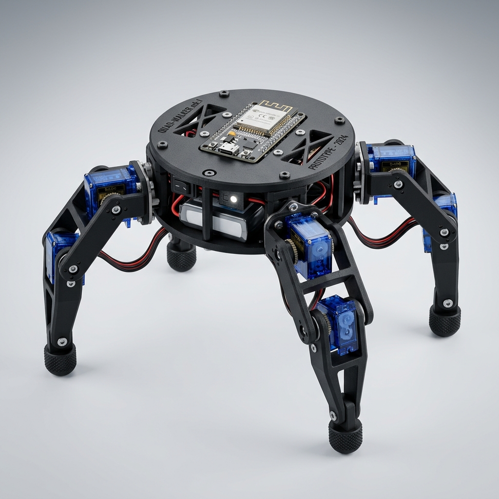

# USS SpiderBot — Robot Cuadrúpedo de Reconocimiento y Rescate

[](https://opensource.org/licenses/MIT)
[](https://micropython.org/)
[](https://openscad.org/)

**USS SpiderBot** es un prototipo de robot cuadrúpedo articulado de 8 grados de libertad (8-DoF) controlado de forma inalámbrica por una ESP32 y desarrollado bajo un modelo de programación asíncrona en **MicroPython**. El robot está diseñado para operar en entornos hostiles de búsqueda y rescate, detectando obstáculos e inestabilidades físicas de forma inteligente en el borde (Edge AI).

---

<p align="center">
  
</p>

---

## 📄 Documentación y Entregables del Proyecto
Toda la fundamentación teórica, análisis físico y guías se encuentran compilados en formato PDF dentro del repositorio:
*   📚 **[Informe Técnico Final (PDF)](docs/informe_proyecto_spiderbot.pdf):** Documento formal con todo el desglose metodológico, cálculos de torque y diagramas.
*   📊 **[Presentación de Defensa Beamer (PDF)](docs/presentacion_hall_spiderbot.pdf):** Diapositivas oficiales preparadas para la exposición en el Hall de la Universidad.
*   📐 **[Guía de Modelado y CAD en OpenSCAD (PDF)](docs/guia_openscad.pdf):** Manual de desarrollo paramétrico de piezas e impresión 3D.
*   🛠️ **[Reporte de Diseño e Integración 3D (Markdown)](docs/reporte_evaluacion_diseno_3d.md):** Evaluación física y geométrica para el montaje de los nuevos componentes.

---

## 🛠️ Arquitectura de Hardware y Potencia
El diseño electrónico prioriza la estabilidad de la lógica de control aislando galvánicamente el ruido electromecánico inducido por los actuadores:

*   **Lógica de Control:** ESP32 DevKit V1 (38 pines) + IMU MPU6050 + Sensor de ultrasonido HC-SR04 + Zumbador activo de 5V.
*   **Actuación:** 8 servomotores SG90 / MG90S conectados a puertos GPIO directos con PWM.
*   **Alimentación Aislada (Dual LM2596):**
    *   **Pack A (2S 18650, 7.4V) ➔ LM2596 #1 (Ajustado a 6.0V):** Alimentación exclusiva del riel de potencia de los 8 servomotores.
    *   **Pack B (2S 18650, 7.4V) ➔ LM2596 #2 (Ajustado a 5.0V):** Alimentación limpia para la ESP32 (pin Vin) y los sensores.
    *   *Nota:* Las tierras (GND) de ambos convertidores se unifican en un nodo de referencia común.

### 📌 Mapa de Conexiones Físicas (Pinout)

| GPIO ESP32 | Componente | Tipo de Señal | Descripción |
| :--- | :--- | :--- | :--- |
| **GPIO 21** | MPU6050 (IMU) | SDA (I2C) | Bus de datos serie de la unidad inercial. |
| **GPIO 22** | MPU6050 (IMU) | SCL (I2C) | Bus de reloj serie de la unidad inercial. |
| **GPIO 18** | HC-SR04 (Sonar) | TRIGGER | Salida digital de pulso de disparo. |
| **GPIO 19** | HC-SR04 (Sonar) | ECHO | Entrada digital de pulso de retorno. |
| **GPIO 14** | Buzzer Activo | Salida Digital | Señal de alarma en caso de proximidad. |
| **GPIO 13, 15, 4, 23** | Servos Coxa | Salida PWM | Control de articulaciones de cadera (FR, FL, RL, RR). |
| **GPIO 12, 2, 5, 25** | Servos Fémur | Salida PWM | Control de articulaciones de rodilla (FR, FL, RL, RR). |
| **Vin (ESP32)** | LM2596 #2 Out | Alimentación | Tensión lógica de entrada regulada (5.0V). |
| **3.3V (ESP32)** | MPU6050 (IMU) | Alimentación | Tensión de funcionamiento para sensor inercial. |
| **GND (Unificado)** | Todo el sistema | Tierra común | Referencia negativa común unificada. |

---

## 🧠 Inteligencia Artificial Sensorial y Failsafe Embebido
El robot incorpora un módulo de Edge AI local en MicroPython ([classifier_ia.py](firmware/classifier_ia.py)) que procesa las firmas inerciales de la IMU para clasificar el estado dinámico del cuadrúpedo:

*   **`FALLEN` (Caída):** Se activa si la inclinación del eje Pitch o Roll supera los $\pm 45^\circ$, ante una caída libre (gravedad $|a| < 0.2g$) o choque violento ($|a| > 2g$). El lazo reactivo de control entra en *failsafe*: cancela la marcha, envía los servos a posición estática y emite un pitido de pánico intermitente.
*   **`PUSHED` (Perturbación):** Detecta empujones externos bruscos si la velocidad angular del giroscopio supera los $120^\circ/\text{s}$ mientras el robot está quieto.
*   **`SLIPPING` (Derrape):** Clasifica si el robot intenta caminar pero no experimenta la oscilación inercial periódica normal en su eje de avance (baja varianza en el acelerómetro horizontal).

---

## 💻 Servidor HTTP y Dashboard de Control Real
La ESP32 inicia un Access Point Wi-Fi (`USS_SpiderBot_AP`) y levanta un servidor HTTP asíncrono no bloqueante en el puerto 80.
*   **Servicio Web:** Sirve el archivo interactivo `dashboard.html` por bloques de 512 bytes para prevenir la fragmentación de la memoria RAM.
*   **Estética:** Diseño futurista en modo oscuro con *glassmorphic blur*, mandos de control D-pad, atajos de teclado completos (W, A, S, D, Espacio, R) y telemetría inercial en tiempo real representada en una retícula SVG activa.
*   **Failsafe de Conexión:** Si el navegador detecta la pérdida de la comunicación Wi-Fi por más de dos peticiones, bloquea automáticamente los mandos y despliega una pantalla de reconexión.

---

## 📂 Estructura del Repositorio

```text
├── cad/                  # Modelos paramétricos en OpenSCAD y STLs imprimibles
├── docs/                 # Documentos de LaTeX (Informe y Diapositivas) y PDFs
├── firmware/             # Código fuente en MicroPython para la ESP32
│   ├── index.html        # Dashboard versión Simulación/Demo
│   ├── dashboard.html    # Dashboard versión Pruebas Reales (Autónomo)
│   ├── web_server.py     # Servidor HTTP asíncrono y enrutador de API
│   ├── classifier_ia.py  # Clasificador embebido de IA Sensorial (Decision Tree)
│   ├── main.py           # Bucle de control asíncrono principal (Gait Control & Failsafe)
│   └── ...               # Módulos auxiliares de hardware (mpu6050, sonar, buzzer)
├── LICENSE               # Licencia de código abierto MIT
└── README.md             # Documentación principal de presentación
```

---

## ⚠️ Protocolo de Seguridad y Operación Eléctrica
Al realizar pruebas y depuraciones físicas:
1.  **Nunca conectes el puerto USB al PC mientras el interruptor de las baterías esté encendido**. Si alimentas por el pin `Vin` (vía LM2596) y conectas el USB simultáneamente, puedes dañar el puerto de tu computadora o el regulador de la ESP32 por corriente de retorno.
2.  **Desconecta la línea Vin** si vas a cargar o depurar código por puerto USB.
3.  **Calibra siempre los potenciómetros de los LM2596** con un multímetro a los voltajes indicados (6.0V y 5.0V) *antes* de conectarlos a la ESP32 y a los servomotores.

---

## 👥 Autores y Licencia
Este proyecto ha sido desarrollado por el Grupo de Trabajo de la Universidad San Sebastián (Puerto Montt, Chile - 2026).
Distribuido bajo la Licencia **MIT** (Consulte [LICENSE](LICENSE) para más detalles).
