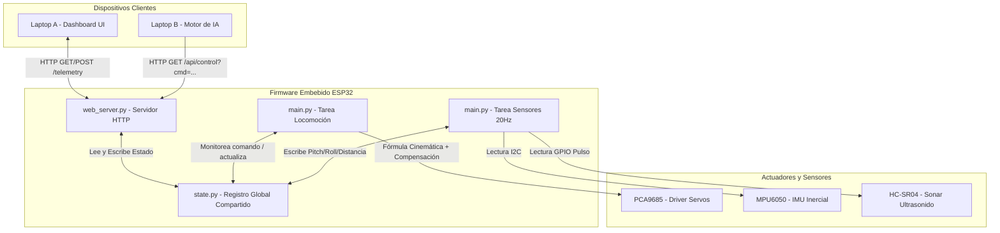

# Arquitectura General y Flujos — USS SpiderBot

Esta sección describe la arquitectura lógica del firmware, el flujo de procesamiento de señales en paralelo y los patrones de diseño de software aplicados para lograr el control dinámico del robot cuadrúpedo.

---

## 1. Diagrama de Bloques de la Arquitectura (Mermaid.js)

El firmware utiliza la concurrencia asíncrona cooperativa en MicroPython. Tres hilos o corrutinas corren de forma concurrente, comunicándose a través de un registro de estado centralizado:

---

## 2. Flujo de Datos Global (Request-Response & Control Loop)

La información fluye a través del sistema mediante un modelo desacoplado por estado:

1.  **Lectura Frecuente (Lazo de Entrada):** La tarea asíncrona `sensor_updater()` corre de forma continua cada 50ms (20Hz). Lee los datos brutos del sensor ultrasónico y de la IMU MPU6050 y actualiza directamente `state.pitch_actual`, `state.roll_actual` y `state.distancia_actual` en el módulo [state.py](file:///mnt/9b846436-0407-4e80-b8af-5417ffbdee8e/Github/USS%20SPIDERBOT%20(solemne%203)/firmware/state.py).
2.  **Peticiones del Operador (Entrada por Red):** Cuando el usuario interactúa con la página web o un modelo de IA en la laptop, se envía una petición Fetch a `/api/control?cmd=forward`.
3.  **Procesamiento HTTP (Asíncrono):** El servidor HTTP asíncrono en `web_server.py` procesa la petición de forma no bloqueante y escribe el comando en `state.comando_actual`.
4.  **Bucle de Decisión y Control (Locomoción):** La corrutina `locomotion_loop()` en `main.py` vigila permanentemente el estado de las variables físicas y los comandos:
    *   **Prioridad 1 (Freno de Emergencia):** Si `state.distancia_actual < 15.0`, la corrutina detiene inmediatamente la marcha, emite alertas sonoras con el Buzzer y fuerza `state.comando_actual = "stop"`.
    *   **Prioridad 2 (Locomoción):** Si el comando es `"forward"`, ejecuta un paso de la caminata.
    *   **Prioridad 3 (Estabilización Dinámica):** Al mover las articulaciones, se consultan `state.pitch_actual` y `state.roll_actual` para calcular y aplicar en tiempo real correcciones angulares de fémur a las patas apoyadas, manteniendo estable el chasis.

---

## 3. Patrones de Diseño de Software Aplicados

*   **Multitarea Cooperativa (Cooperative Multitasking):** Implementada a través del bucle de eventos asíncrono de `uasyncio`. En lugar de utilizar retardos bloqueantes (`time.sleep_ms`) o hilos físicos del procesador (que consumen demasiados recursos de memoria y son inestables en MicroPython), las tareas liberan la CPU cediéndola voluntariamente a otras mediante `await asyncio.sleep_ms()`.
*   **Patrón Shared Registry (Estado Singleton):** Centralizado en [state.py](file:///mnt/9b846436-0407-4e80-b8af-5417ffbdee8e/Github/USS%20SPIDERBOT%20(solemne%203)/firmware/state.py). Permite desacoplar por completo la ejecución física de los servomotores de las peticiones de red del servidor HTTP, solucionando la importación circular de módulos.
*   **Control Reactivo Proporcional (P-Control):** La estabilización inercial activa calcula la corrección mediante un factor de escala estático multiplicativo respecto a la desviación angular ($\Delta \text{Ángulo} \times \text{Factor}$). Esto imita la lógica básica de control proporcional industrial, brindando respuestas inmediatas y suaves sin sobrecarga matemática.
