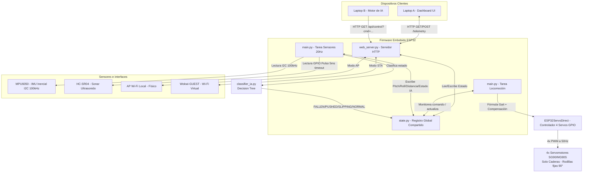

# Arquitectura General y Flujos — USS SpiderBot

Esta sección describe la arquitectura lógica del firmware, el flujo de procesamiento de señales en paralelo, las modalidades adaptativas para simulación en Wokwi y los patrones de diseño de software aplicados.

---

## 1. Diagrama de Bloques de la Arquitectura (Mermaid.js)

El firmware utiliza la concurrencia asíncrona cooperativa en MicroPython. Tres corrutinas corren de forma concurrente, comunicándose a través de un registro de estado centralizado. 

### Ejecución Adaptativa (Detección del Entorno)
El sistema detecta automáticamente si se encuentra en el robot físico o en Wokwi escaneando las redes Wi-Fi locales en busca de la red virtual `"Wokwi-GUEST"`:
1.  **Modo Hardware Real:** Configura el Wi-Fi como **Access Point (AP)** privado (`USS_SpiderBot_AP`) y realiza lecturas de la IMU física MPU6050 a través de I2C a 100kHz. Los 4 servos de cadera son comandados directamente por GPIOs (23, 17, 15, 13) a través de `ESP32ServoDirect`.
2.  **Modo Simulación:** Configura el Wi-Fi como **Estación (STA)** conectándose a `Wokwi-GUEST` para permitir el acceso al simulador. Los servos son controlados con los mismos pines GPIO a través del generador PWM directo.

---

## 2. Flujo de Datos Global (Request-Response & Control Loop)

La información fluye a través del sistema mediante un modelo desacoplado por estado:

1.  **Lectura Frecuente (Lazo de Entrada):** La tarea asíncrona `sensor_updater()` corre de forma continua cada 50ms (20Hz). Lee los datos brutos del sensor ultrasónico (con timeout de 5ms y backoff adaptativo a 0.5Hz tras 5 fallos consecutivos) y de la IMU MPU6050 por I2C a 100kHz. Actualiza `state.pitch_actual`, `state.roll_actual`, `state.distancia_actual` y `state.estado_ia` (clasificado por el Decision Tree de `classifier_ia.py`) en el módulo [state.py](file:///mnt/9b846436-0407-4e80-b8af-5417ffbdee8e/Github/USS%20SPIDERBOT%20(solemne%203)/firmware/state.py).
2.  **Peticiones del Operador (Entrada por Red):** Cuando el usuario interactúa con la página web o un modelo de IA en la laptop, se envía una petición Fetch a `/api/control?cmd=forward`.
3.  **Procesamiento HTTP (Asíncrono con GC Lazy):** El servidor HTTP asíncrono en `web_server.py` procesa la petición de forma no bloqueante y escribe el comando en `state.comando_actual`. Tras enviar la respuesta, ejecuta `gc.collect()` solo si la memoria RAM libre es inferior a 15KB (`gc.mem_free() < 15000`), desplazando la recolección de basura a segundo plano y minimizando la latencia de respuesta.
4.  **Bucle de Decisión y Control (Locomoción):** La corrutina `locomotion_loop()` en `main.py` vigila permanentemente el estado de las variables físicas y los comandos:
    *   **Prioridad 1 (Detección de Caída por IA):** Si `state.estado_ia == "FALLEN"`, la corrutina detiene la marcha inmediatamente, emite alerta acústica de postura y fuerza `state.comando_actual = "stop"`.
    *   **Prioridad 2 (Freno de Emergencia):** Si `state.distancia_actual < 15.0`, la corrutina detiene inmediatamente la marcha, emite alertas sonoras con el Buzzer y fuerza `state.comando_actual = "stop"`.
    *   **Prioridad 3 (Locomoción):** Si el comando es `"forward"`, ejecuta un paso de la caminata de gateo (Crawl Gait) interpolando las 4 caderas.
    *   **Prioridad 4 (Estabilización Dinámica):** Al mover las articulaciones, se consultan `state.pitch_actual` y `state.roll_actual` para calcular y aplicar en tiempo real correcciones angulares sobre las caderas en apoyo, manteniendo estable el chasis.

---

## 3. Patrones de Diseño de Software Aplicados

*   **Multitarea Cooperativa (Cooperative Multitasking):** Implementada a través del bucle de eventos asíncrono de `uasyncio`. En lugar de utilizar retardos bloqueantes (`time.sleep_ms`) o hilos físicos del procesador (que consumen demasiados recursos de memoria y son inestables en MicroPython), las tareas liberan la CPU cediéndola voluntariamente a otras mediante `await asyncio.sleep_ms()`.
*   **Patrón Shared Registry (Estado Singleton):** Centralizado en [state.py](file:///mnt/9b846436-0407-4e80-b8af-5417ffbdee8e/Github/USS%20SPIDERBOT%20(solemne%203)/firmware/state.py). Permite desacoplar por completo la ejecución física de los servomotores de las peticiones de red del servidor HTTP, solucionando la importación circular de módulos.
*   **Control Reactivo Proporcional (P-Control):** La estabilización inercial activa calcula la corrección mediante un factor de escala estático multiplicativo respecto a la desviación angular ($\Delta \text{Ángulo} \times \text{Factor}$). Esto imita la lógica básica de control proporcional industrial, brindando respuestas inmediatas y suaves sin sobrecarga matemática.
*   **Abstracción de Control Directo (Hardware/Simulador):** La clase `ESP32ServoDirect` unifica la interfaz de control de los servomotores a través del método `.set_servo_angle()`. Esta capa oculta la modulación PWM nativa de 16 bits de MicroPython (`duty_u16`), permitiendo que el algoritmo de locomoción opere con los mismos comandos y mapeos físicos tanto en el simulador Wokwi como en el hardware real.
*   **Recolección de Basura Diferida (GC Lazy):** Implementado en `web_server.py`. La GC se ejecuta solo si la memoria libre baja de 15KB (`gc.mem_free() < 15000`) tras servir la respuesta HTTP. Esto evita pausas de latencia impredecibles durante la marcha o la telemetría.
*   **Backoff Adaptativo de Sonar:** El lazo `sensor_updater()` en `main.py` reduce la frecuencia de lectura del HC-SR04 de 20Hz a 0.5Hz (cada 40 ciclos) si se producen 5 timeouts consecutivos del sensor (5ms por pulso), evitando el bloqueo prolongado de la CPU por fallos del hardware.
