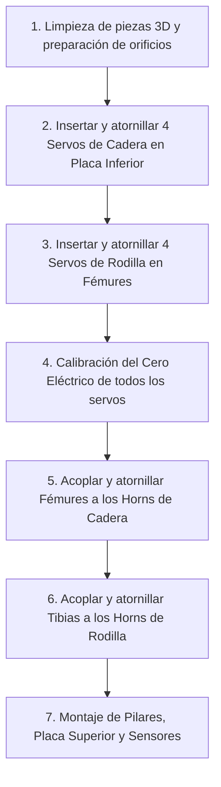
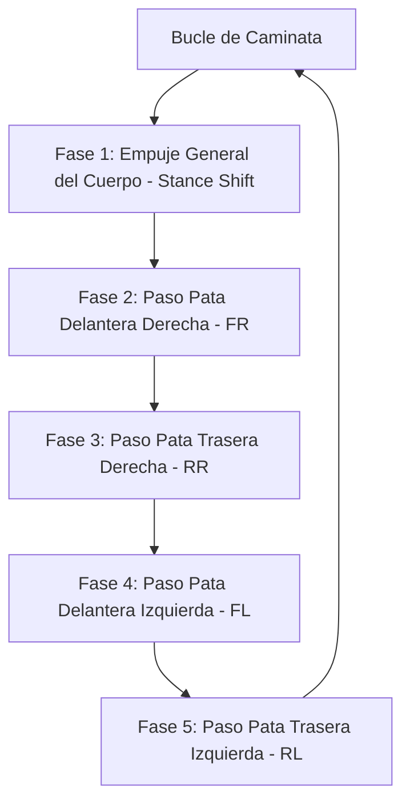

# Guía de Armado Electrónico y Sistema de Locomoción — USS SpiderBot
**Solemne 3 — Taller de Programación I (Universidad San Sebastián)**

Este documento contiene las especificaciones detalladas para el armado de la electrónica del robot cuadrúpedo **USS SpiderBot**, el diseño lógico de su sistema de locomoción (marcha de gateo) y las instrucciones para realizar pruebas de simulación y calibración inercial.

---

## 1. Arquitectura del Sistema y Lista de Materiales (BOM)

El **USS SpiderBot** es un robot caminador cuadrúpedo de **8 grados de libertad (8-DoF)** diseñado para el reconocimiento de zonas de desastre (escombros). Cuenta con autonomía inercial para auto-nivelarse en terrenos rugosos y evasión reactiva ante obstáculos frontales.

### Lista de Componentes Electrónicos
*   **1x Microcontrolador ESP32 DevKit V1 (38 pines):** Cerebro del robot que ejecuta el bucle de control en MicroPython.
*   **1x Driver PWM PCA9685 (16 canales I2C):** Módulo encargado de generar las señales de pulso para controlar los 8 servos, liberando pines del ESP32 y garantizando estabilidad temporal.
*   **8x Servomotores SG90 o MG90S:** Actuadores para el movimiento de las articulaciones (2 por pata: Coxa y Fémur).
*   **1x Unidad de Medida Inercial (IMU) GY-521 (MPU6050):** Acelerómetro y giroscopio de 6 ejes que mide la inclinación (Pitch y Roll) para la auto-estabilización.
*   **1x Sensor de Distancia Ultrasónico HC-SR04:** Sensor de prevención para detener la marcha si hay obstáculos a menos de 15 cm.
*   **1x Buzzer Activo (5V):** Actuador acústico para emitir pitidos de encendido, alertas de colisión inminente y alarmas de inestabilidad extrema.
*   **1x Batería Li-ion 2S (7.4V nominal) + Regulador de Voltaje Step-Down (UBEC 5V/3A):** Fuente de energía de alta capacidad y regulador de voltaje para aislar la potencia de los servos.

---

## 2. Guía de Alimentación y Conexiones (Pinout)

### IMPORTANTE: El Aislamiento de Potencia
Los servomotores SG90/MG90S pueden consumir picos de corriente superiores a **500 mA** cada uno cuando realizan esfuerzo mecánico (por ejemplo, al levantar el peso del robot).
*   **Regla de Oro:** **NUNCA** alimente los servos desde las salidas de 3.3V o 5V del microcontrolador ESP32. Hacerlo causará caídas de tensión (brownouts) que reiniciarán constantemente el procesador.
*   **Solución:** Los servomotores deben conectarse directamente a la bornera de alimentación externa del módulo **PCA9685** (marcada como V+ y GND), la cual se alimenta a través de la salida de 5V del regulador UBEC de 3A conectado a la batería.
*   **GND Común:** Conecte el terminal GND del ESP32, el terminal GND del bus de señal del PCA9685 y el terminal GND de la bornera de alimentación externa del regulador en un punto común para establecer una referencia de voltaje unificada.

### Tabla de Conexiones del ESP32

El bus de comunicación I2C es compartido por el driver PCA9685 y la IMU MPU6050, optimizando el uso de pines en el microcontrolador.

| Componente | Pin en Componente | Pin en ESP32 | Tipo de Señal | Propósito / Función |
| :--- | :---: | :---: | :--- | :--- |
| **MPU6050 (IMU)** | VCC / GND | 3.3V / GND | Alimentación | Energía para el procesado digital inercial |
| **MPU6050 (IMU)** | SDA / SCL | GPIO 21 / GPIO 22 | I2C (Compartido) | Lectura de inclinación angular en grados |
| **PCA9685 (Driver)** | VCC / GND | 3.3V / GND | Alimentación (Lógica) | Energía para el procesador interno I2C |
| **PCA9685 (Driver)** | SDA / SCL | GPIO 21 / GPIO 22 | I2C (Compartido) | Comandos de posición angular para servos |
| **PCA9685 (Driver)** | V+ (Bornera) | Salida 5V (UBEC) | Alimentación (Potencia)| Alimentación dedicada para los 8 servos |
| **HC-SR04 (Sonar)** | VCC / GND | 5V / GND | Alimentación | El transductor de ultrasonido requiere 5V |
| **HC-SR04 (Sonar)** | TRIG / ECHO | GPIO 18 / GPIO 19 | Digital I/O | Control de emisión y lectura de eco del sonar |
| **Buzzer Activo** | Terminal + / - | GPIO 14 / GND | Digital OUT | Activación y modulación de tonos de alerta |

---

## 3. Esquema de Cableado Detallado

A continuación se muestra el conexionado esquemático en formato de texto. El bus I2C (`GPIO 21` y `GPIO 22`) se deriva en paralelo hacia ambos dispositivos esclavos (`PCA9685` y `MPU6050`).

```text
                           +---------------------------+
                           |      BATERIA 2S 7.4V      |
                           +-------------+-------------+
                                         | (+7.4V)
                                         v
                           +---------------------------+
                           |   REGULADOR UBEC 5V/3A    |
                           +------+-------------+------+
                                  |             |
                    (5V Potencia) |             | (5V Control/Logica)
                                  v             v
  +------------------------------+       +------------------------------+
  |     PCA9685 - Bornera V+     |       |         ESP32 - Vin          |
  |     PCA9685 - Bornera GND ---+-------+--->     ESP32 - GND          |
  +------------------------------+       +--------------+---------------+
                                                        | (3.3V Regulado)
                                                        v
                                         +------------------------------+
                                         |   MPU6050 (IMU) - VCC        |
                                         |   MPU6050 (IMU) - GND --->GND|
                                         +------------------------------+

  CONEXION DE SENALES (I2C y GPIOs):
  ==================================
  ESP32 GPIO 21 (SDA) <---------+--------> PCA9685 SDA
                                +--------> MPU6050 SDA
  
  ESP32 GPIO 22 (SCL) <---------+--------> PCA9685 SCL
                                +--------> MPU6050 SCL
  
  ESP32 GPIO 18 (TRIG) <----------------> HC-SR04 TRIG
  ESP32 GPIO 19 (ECHO) <----------------> HC-SR04 ECHO
  ESP32 GPIO 14 (SIG)  <----------------> Buzzer (+) [Buzzer (-) a GND]
```


### Configuración de Canales de Servomotores (PCA9685)
El robot se divide en 4 patas numeradas de la 0 a la 3, en una **configuración cinemática Pitch-Pitch (2 ejes horizontales paralelos por pata)**. Esto significa que ambos servos operan en el plano vertical: el de cadera (**Coxa** / Hip Pitch) realiza la flexión de la cadera y el de rodilla (**Fémur** / Knee Pitch) la de la rodilla, prescindiendo del giro horizontal para mayor torque y estabilidad de carga:

*   **Pata 0 (Delantera Derecha - FR):** Coxa (Hip Pitch) $\rightarrow$ **Canal 0** | Fémur (Knee Pitch) $\rightarrow$ **Canal 1**
*   **Pata 1 (Delantera Izquierda - FL):** Coxa (Hip Pitch) $\rightarrow$ **Canal 2** | Fémur (Knee Pitch) $\rightarrow$ **Canal 3**
*   **Pata 2 (Trasera Izquierda - RL):** Coxa (Hip Pitch) $\rightarrow$ **Canal 4** | Fémur (Knee Pitch) $\rightarrow$ **Canal 5**
*   **Pata 3 (Trasera Derecha - RR):** Coxa (Hip Pitch) $\rightarrow$ **Canal 6** | Fémur (Knee Pitch) $\rightarrow$ **Canal 7**

---

## 4. Guía de Ensamblaje Mecánico con Piezas 3D

El correcto ensamblaje de las piezas estructurales impresas en 3D con los componentes electrónicos es crucial para evitar rozamientos, esfuerzos innecesarios en los servos y desgaste de material.

### 4.1 Preparación de las Piezas Impresas
*   **Limpieza de Cavidades:** Retire con cuidado todo el material de soporte de las cavidades destinadas a los servomotores en la `placa_base_inferior` y los fémures (`eslabon_femur`). Las tolerancias son estrechas (0.3mm total) para un ajuste a presión firme (snug fit).
*   **Acondicionamiento de Agujeros:** Los agujeros para los tornillos M2 de fijación de bridas de servo están diseñados con un diámetro de 2.0mm. Se recomienda roscar previamente los orificios metiendo y sacando un tornillo de prueba para facilitar el ensamblaje final.

### 4.2 Secuencia de Montaje Mecánico Paso a Paso



1.  **Paso 1: Montaje de Servos de Cadera (Hip Pitch)**
    *   Tome la **Placa Base Inferior** e inserte a presión cada uno de los 4 servos de cadera en sus respectivos soportes perimetrales (`soporte_servo_cadera`).
    *   **Orientación:** El eje de salida estriado de cada servo debe quedar posicionado hacia el lado del rebaje frontal del soporte (X = 5.5).
    *   Asegure los servos utilizando tornillos autorroscantes M2 (dos por servo) atravesando las bridas del servo hacia la base de plástico.
    *   Rutee los cables de señal hacia el interior del chasis a través de las canaletas internas.
2.  **Paso 2: Montaje de Servos de Rodilla (Knee Pitch)**
    *   Tome los 4 fémures (`eslabon_femur`) e inserte a presión un servo en el bolsillo de rodilla de cada fémur.
    *   **Orientación:** El eje estriado de salida debe quedar alineado con el extremo exterior del fémur (X = 55.0).
    *   Asegure el servo al fémur con dos tornillos autorroscantes M2.
    *   Pase el cable del servo a lo largo de la ranura lateral del fémur hacia la articulación de la cadera.
3.  **Paso 3: Calibración del Cero Eléctrico (CRÍTICO)**
    *   Antes de acoplar los fémures y tibias, conecte el ESP32 y el PCA9685 y enciéndalos.
    *   Cargue el firmware `main.py` para forzar a todos los servos a la posición de reposo estática (`pos_reposo()`): **caderas a $90^\circ$** y **rodillas a $60^\circ / 120^\circ$**.
    *   *Nota: Nunca intente ensamblar los brazos de plástico (horns) con los servos apagados o desalineados.*
4.  **Paso 4: Acoplamiento del Fémur a la Cadera**
    *   Con los servos energizados en reposo ($90^\circ$), tome el fémur y encaje su acoplamiento de horn en el eje del servo de cadera.
    *   **Alineación:** El fémur debe quedar alineado a escuadra vertical (apuntando a $90^\circ$ perpendicular respecto al plano de la base).
    *   Fije el fémur introduciendo el tornillo central del servo y dos tornillos pequeños de fijación en los orificios del horn.
5.  **Paso 5: Acoplamiento de la Tibia a la Rodilla**
    *   Con los servos energizados en reposo ($60^\circ$ para pata derecha, $120^\circ$ para pata izquierda), tome la tibia (`tibia_inferior`) y encaje su acoplamiento de horn en el eje del servo de rodilla.
    *   **Alineación:** La tibia debe quedar apuntando hacia abajo, formando una pose estable.
    *   Fije la tibia usando el tornillo central del servo y tornillos pequeños de fijación.
6.  **Paso 6: Montaje del Doble Deck y Componentes Superiores**
    *   Fije los 4 pilares espaciadores M3 de 22mm en los orificios de la Placa Base Inferior.
    *   Posicione el driver PCA9685 en la placa inferior y rutee todos los cables. Conecte los 8 servos a sus respectivos canales (0-7).
    *   Coloque la **Placa Base Superior** sobre los pilares y asegúrela con tornillos M3.
    *   Fije el ESP32 DevKit V1 en los soportes superiores de la tapa.
    *   Monte la IMU MPU6050 y el sensor ultrasónico HC-SR04 y realice el conexionado de señales con jumpers según el pinout de la sección 2.

---

## 5. Algoritmo de Locomoción: Marcha de Gateo (Crawl Gait)

### Cinemática del Movimiento Cuadrúpedo
Para que el robot camine manteniendo estabilidad estática, debe cumplir la regla física del **Polígono de Sustentación**. En cualquier instante en que se levante una pata, las otras tres deben estar firmemente apoyadas en el suelo formando un triángulo de soporte que encierre la proyección vertical del centro de masa (CoM) del chasis.

El ciclo de la marcha de gateo consta de **5 fases secuenciales**:



### Definición de Ángulos del Ciclo
Para mover una articulación de forma simétrica a la derecha e izquierda, debemos tomar en cuenta la **inversión mecánica de los servos en espejo** en el chasis:
*   **Fémur en Reposo (Apoyo):** Derecha = $60^\circ$ | Izquierda = $120^\circ$.
*   **Fémur Levantado (Swing):** Ambas patas van a $90^\circ$ (posición media que levanta el pie del suelo).
*   **Coxa Adelantado (FWD):** Derecha = $110^\circ$ | Izquierda = $75^\circ$.
*   **Coxa Atrasado (BWD):** Derecha = $70^\circ$ | Izquierda = $105^\circ$.

### El Ciclo Paso a Paso:
1.  **Fase de Empuje (Stance Shift):** Con las 4 patas en apoyo ($60^\circ / 120^\circ$), todos los servos Coxa se mueven simultáneamente hacia atrás (Coxa BWD). Esto desplaza el cuerpo del robot hacia adelante.
2.  **Paso Pata 0 (FR):** Levanta el fémur a $90^\circ$, gira su Coxa a FWD ($110^\circ$), y vuelve a bajar el fémur a su ángulo de apoyo ($60^\circ$).
3.  **Paso Pata 3 (RR):** Levanta el fémur a $90^\circ$, gira su Coxa a FWD ($110^\circ$), y vuelve a bajar el fémur a su ángulo de apoyo ($60^\circ$).
4.  **Paso Pata 1 (FL):** Levanta el fémur a $90^\circ$, gira su Coxa a FWD ($75^\circ$), y vuelve a bajar el fémur a su ángulo de apoyo ($120^\circ$).
5.  **Paso Pata 2 (RL):** Levanta el fémur a $90^\circ$, gira su Coxa a FWD ($75^\circ$), y vuelve a bajar el fémur a su ángulo de apoyo ($120^\circ$).

---

## 6. Control y Lazo de Compensación Inercial Activa

El control reactivo del robot opera de manera simultánea en el firmware. En cada subdivisión del movimiento:
1.  Se lee la inclinación en Pitch y Roll desde el acelerómetro **MPU6050**.
2.  Si la inclinación supera la tolerancia ($\pm 3^\circ$), se calcula un factor de compensación diferencial que se aplica a los ángulos objetivo de los fémures apoyados:
    $$\text{Ángulo Compensado} = \text{Ángulo Base} \pm (\text{Inclinación} \times \text{Factor de Compensación})$$
3.  Esta corrección angular levanta las patas del lado inclinado hacia abajo y baja las del lado inclinado hacia arriba, logrando una auto-nivelación en tiempo real.
4.  Las patas en fase de oscilación (levantadas a $90^\circ$ en swing) se excluyen de la compensación para que su movimiento de avance no interfiera mecánicamente.

---

## 7. Procedimiento de Pruebas y Puesta en Marcha

Para asegurar un armado exitoso y evitar daños en los componentes, ejecute la siguiente secuencia de pruebas antes de colocar el chasis impreso en 3D en el suelo:

### Paso A: Calibración del Cero Mecánico
1.  Conecte el ESP32 y el PCA9685 sin montar los brazos de servo (horns) de plástico a los servomotores.
2.  Cargue el código firmware `main.py` para llevar los servos a la posición de reposo (`pos_reposo()`): caderas a $90^\circ$ y muslos a $60^\circ / 120^\circ$.
3.  Con los servos energizados y fijos en esa posición de control, coloque mecánicamente los horns plásticos alineados a escuadra de forma manual (perpendiculares para la cadera, y en la inclinación correspondiente para el muslo). Atornille los horns. Esto garantiza que el software y la estructura física compartan la misma referencia angular de origen.

### Paso B: Calibración de Offsets del Acelerómetro
1.  Posicione el robot en una superficie completamente horizontal y plana de forma estable.
2.  Ejecute en Thonny el script `calibrate_mpu.py`.
3.  El programa tomará 100 muestras consecutivas, promediará los offsets de aceleración del chip y guardará estos valores en el archivo local `mpu_offsets.txt`. El programa principal `main.py` cargará este archivo al arrancar para referenciar los $0^\circ$ exactos.

### Paso C: Simulación del Circuito en Wokwi
Antes de realizar el conexionado físico final con jumpers, puede validar de forma interactiva el circuito y su lógica en el simulador en la nube:
1.  Vaya a [wokwi.com](https://wokwi.com) y cree un nuevo proyecto de tipo **ESP32 con MicroPython**.
2.  Sustituya el archivo de conexiones por el contenido de nuestro [diagram.json](file:///mnt/9b846436-0407-4e80-b8af-5417ffbdee8e/Github/Taller%20de%20Programaci%C3%B3n%20I/Unidad%203/USS_SpiderBot/diagram.json).
3.  Suba los controladores locales (`mpu6050.py`, `sonar_sensor.py`, `buzzer_alert.py`, `pca9685.py`) y el código `main.py`.
4.  Inicie la simulación, ajuste la distancia del sensor ultrasónico y observe cómo el buzzer y los servos reaccionan dinámicamente.

---

## 8. Pasos Pendientes para la Finalización del Proyecto

Para llevar el **USS SpiderBot** a su culminación funcional y entrega exitosa en la Solemne 3, se debe seguir la siguiente lista de tareas críticas:

### 1. Impresión de Piezas Físicas (FDM)
*   **Parámetros de Laminación recomendados (Slicing):**
    *   **Altura de capa:** 0.2 mm.
    *   **Perímetros:** 3 o 4 (indispensable para la resistencia de los soportes de servos y orificios M2).
    *   **Relleno (Infill):** 20% a 30% en tipo *Gyroid* (giroidal) para optimizar la relación peso/resistencia.
    *   **Material:** PLA de buena calidad para el cuerpo y las patas, o PETG si se requiere mayor resistencia a impactos en terrenos rugosos.
*   **Impresoras Disponibles:** Se recomienda utilizar la **Creality K1** o **Ender 3 V3 KE** para las placas de chasis principales por su velocidad y precisión dimensional, y la **Ender 3 V3 SE** para las tibias y fémures.

### 2. Calibración Mecánica y del Lazo de Control (Fase Física)
*   **Calibración Estática (cero mecánico):** Comprobar que en la pose de reposo estática (`pos_reposo()` en `main.py`), los fémures y tibias queden perfectamente alineados a escuadra. Cualquier desviación física de montaje debe corregirse mediante software modificando las constantes de offset angular individuales o desatornillando el horn y volviéndolo a alinear.
*   **Calibración Dinámica del MPU6050:** Ejecutar el calibrador inercial `calibrate_mpu.py` sobre una superficie plana para generar el archivo `mpu_offsets.txt`. Esto evitará derivas angulares y errores de auto-nivelación.

### 3. Ajuste Fino de la Marcha en Suelo (Gait Tuning)
*   **Monitoreo de Consumo de Corriente:** Colocar el robot en el suelo y realizar pruebas de caminata monitoreando que el regulador UBEC de 3A no se sobrecaliente.
*   **Ajuste de Amplitud de Paso:** Si el robot patina o pierde tracción en el suelo, ajustar los rangos angulares de empuje y avance en `caminar_adelante()` dentro de `main.py`. Reducir el ángulo Coxa FWD/BWD (por ejemplo, reducir el swing a $80^\circ - 100^\circ$ en lugar de $70^\circ - 110^\circ$) para suavizar la aceleración.
*   **Ajuste del Coeficiente de Estabilización:** Variar la constante `FACTOR_COMPENSACION` en `main.py` si la nivelación inercial reacciona de forma muy lenta o muy brusca (con oscilaciones).

### 4. Pruebas de Integración y Casos de Fallo
*   **Prueba del Sensor de Obstáculos (HC-SR04):** Verificar que el robot se detenga inmediatamente (marcha abortada) y emita la alarma acústica cuando el sensor ultrasónico detecte un obstáculo a menos de 15 cm.
*   **Prueba de Alarma Inercial:** Validar que el buzzer emita una advertencia si el robot se inclina más de $15^\circ$ en Pitch o Roll, alertando de un posible volcamiento o pérdida de apoyo.
