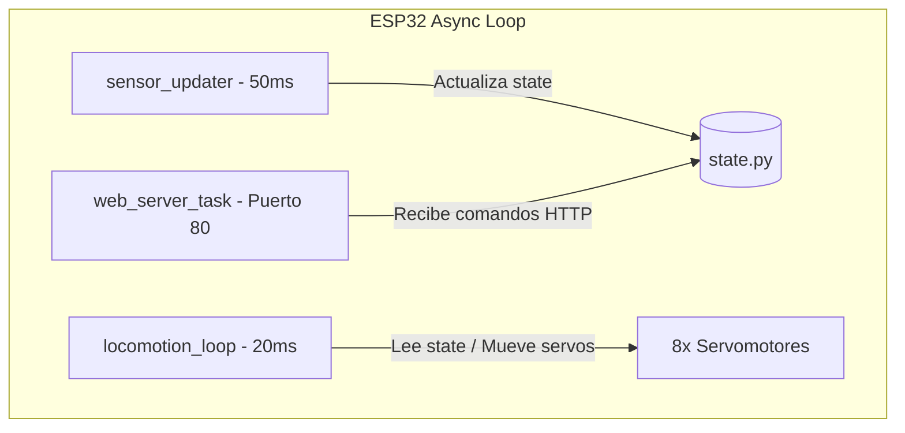

# Manual Definitivo de Armado, Electrónica, Locomoción y Firmware — USS SpiderBot
**Solemne 3 — Taller de Programación I (Universidad San Sebastián, 2026)**

Este documento constituye la guía oficial y definitiva para el ensamblaje mecánico, la integración de la electrónica dual aislada, el conexionado físico (pinout), el centrado de servomotores y la calibración inercial del robot cuadrúpedo **USS SpiderBot**. Además, se detalla la arquitectura de software (MicroPython) y el funcionamiento de la Inteligencia Artificial Sensorial embebida.

---

## 💻 Índice
1. [Especificaciones y Arquitectura General](#1-especificaciones-y-arquitectura-general)
2. [Lista de Materiales y Herramientas (BOM)](#2-lista-de-materiales-y-herramientas-bom)
3. [Integración Eléctrica y Regulación de Potencia Dual](#3-integración-eléctrica-y-regulación-de-potencia-dual)
4. [Pinout y Diagrama de Cableado Detallado](#4-pinout-y-diagrama-de-cableado-detallado)
5. [Guía de Ensamblaje Mecánico 3D Paso a Paso](#5-guía-de-ensamblaje-mecánico-3d-paso-a-paso)
6. [Estructura del Firmware y Mapa de Archivos](#6-estructura-del-firmware-y-mapa-de-archivos)
7. [Algoritmo de Locomoción y Marcha de Gateo](#7-algoritmo-de-locomoción-y-marcha-de-gateo)
8. [Inteligencia Artificial Sensorial (IA Local)](#8-inteligencia-artificial-sensorial-ia-local)
9. [Protocolo de Puesta en Marcha y Calibración](#9-protocolo-de-puesta-en-marcha-y-calibración)
10. [Guía de Diagnóstico y Resolución de Problemas (FAQ)](#10-guía-de-diagnóstico-y-resolución-de-problemas-faq)

---

## 1. Especificaciones y Arquitectura General
El **USS SpiderBot** es un robot móvil terrestre cuadrúpedo articulado con **8 grados de libertad (8-DoF)**. Su diseño físico se basa en una configuración cinemática **Pitch-Pitch** (dos ejes de rotación horizontales y paralelos por pata, correspondientes a las articulaciones de la cadera o *Coxa* y la rodilla o *Fémur*). Esta disposición prescinde de la rotación vertical para maximizar el torque útil y la estabilidad de carga en terrenos rugosos.

### Características Principales:
*   **Microcontrolador Principal:** ESP32 DevKit V1 ejecutando MicroPython asíncrono.
*   **Locomoción Dinámica:** Marcha de gateo estática (*Crawl Gait*) asistida por compensación inercial activa.
*   **Estabilidad Activa:** Lectura inercial en tiempo real (IMU MPU6050) para auto-nivelación de la pose.
*   **Seguridad Reactiva:** Sensor de proximidad frontal (ultrasonido HC-SR04) y buzzer activo de alarma.
*   **IA de Borde (Edge AI):** Clasificador embebido local para detectar caídas, derrapes y perturbaciones.
*   **Interfaz de Operación:** Servidor web asíncrono y control por dashboard Glassmorphism por Wi-Fi.

---

## 2. Lista de Materiales y Herramientas (BOM)

### A. Componentes Electrónicos
*   **1x ESP32 DevKit V1 (38 pines):** Microcontrolador principal de 3.3V.
*   **8x Servomotores SG90 (engranajes de nylon) o MG90S (engranajes metálicos):** Actuadores de torque.
*   **1x Módulo GY-521 (IMU MPU6050):** Acelerómetro y giroscopio de 6 ejes con comunicación I2C.
*   **1x Sensor Ultrasónico HC-SR04:** Transductor de distancia de 5V.
*   **1x Buzzer Activo (5V):** Generador de alarmas y confirmaciones acústicas.
*   **2x Convertidores Step-Down LM2596:** Reguladores reductores de voltaje ajustables (con voltímetro interno o manual).
*   **2x Porta Pilas Duales 2x18650:** Soportes para las celdas de alimentación independiente.
*   **4x Celdas de Litio-Ion 18650 (3.7V / 2500mAh mínimo):** Baterías de alta tasa de descarga.

### B. Materiales de Chasis e Impresión 3D
*   **1x Placa Base Inferior (`cuerpo_cuadruepdo.scad`):** Soporta servos de cadera y portabaterías.
*   **1x Placa Base Superior/Tapa (`cuerpo_cuadruepdo.scad`):** Protege la electrónica y soporta el ESP32.
*   **4x Eslabones Fémur (`femur_cuadrupedo.scad`):** Conectan la cadera con el muslo y alojan los servos de rodilla.
*   **4x Tibias Inferiores Curvas (`tibia_cuadrupedo.scad`):** Brazos de contacto con el suelo.
*   **4x Pilares Separadores:** Pilares de 25mm M3 (plástico o latón) para distanciar el chasis.

### C. Herramientas Recomendadas
*   **Multímetro Digital:** Indispensable para regular el voltaje de salida de los convertidores LM2596.
*   **Destornillador de Precisión:** Phillips (cruz) para fijar servos y horns.
*   **Amarras de Velcro:** Para la fijación inferior de los porta pilas.
*   **Cautín y Soldadura de Estaño:** Para consolidar el nodo de tierra común (GND unificado).

---

## 3. Integración Eléctrica y Regulación de Potencia Dual

El principal enemigo de los robots caminadores pequeños es el **ruido eléctrico** y los **picos de corriente** inducidos por los motores. Al iniciar el movimiento, los 8 servos pueden demandar en conjunto más de **3.0A**, provocando que el voltaje caiga por debajo de 4.0V, lo que gatilla reinicios por bajo voltaje (*brownouts*) en la ESP32.

Para evitar esto, se implementa un **aislamiento absoluto de potencia y lógica**:

```text
  [Pack Batería A (7.4V)] ──> [LM2596 #1 (Regulado a 6.0V)] ──> Riel VCC Servomotores (Servos 0-7)
  [Pack Batería B (7.4V)] ──> [LM2596 #2 (Regulado a 5.0V)] ──> Pin Vin ESP32 y Alimentación Sensores
  
  [GND de Salida LM2596 #1] ──┐
  [GND de Salida LM2596 #2] ──┼──> [NODO DE TIERRA UNIFICADO] ──> Pin GND ESP32
  [GND de todos los Servos] ──┘
```

### 🛠️ Protocolo Obligatorio de Regulación (Paso a Paso):
1.  **Aislamiento Inicial:** No conecte la ESP32, sensores ni servos a los reguladores LM2596 aún.
2.  **Encendido de Batería:** Inserte las pilas 18650 cargadas en los porta pilas y encienda la alimentación de entrada de los LM2596.
3.  **Medición y Ajuste con Multímetro:**
    *   Coloque las puntas de prueba del multímetro en la salida `OUT+` y `OUT-` del **LM2596 #1 (Servos)**. Gire el pequeño tornillo del potenciómetro de bronce en sentido antihorario hasta medir exactamente **6.0V**.
    *   Coloque las puntas de prueba en la salida del **LM2596 #2 (Lógica)**. Ajuste el potenciómetro hasta medir exactamente **5.0V**.
4.  **Verificación Final:** Apague la alimentación, termine el conexionado físico y vuelva a encender solo tras comprobar que los voltajes de alimentación son correctos.

### ⚠️ Reglas Críticas de Seguridad Eléctrica:
*   **GND Unificado:** Es estrictamente obligatorio unir físicamente el GND del circuito de servos (LM2596 #1), el GND del circuito lógico (LM2596 #2) y el GND de la ESP32. Si no están unidos, los servos vibrarán sin control al no tener una referencia de señal común.
*   **Peligro de Backfeeding (Retorno de Voltaje):** **NUNCA** conecte el cable USB a su computadora mientras el interruptor de las baterías esté encendido y entregando 5.0V al pin `Vin` de la ESP32. Muchos clones de ESP32 carecen de diodos de bypass y esta conexión en paralelo puede quemar el puerto USB del computador o dañar el microcontrolador.
    *   *Regla:* Para subir códigos mediante USB, **apague** las baterías. Para pruebas inalámbricas con baterías, **desconecte** por completo el cable USB.

---

## 4. Pinout y Diagrama de Cableado Detallado

Las conexiones físicas directas de la ESP32 DevKit V1 se estructuran para optimizar el ruteo de cables y evitar interferencias en el bus I2C:

| Pin ESP32 | Componente | Tipo de Señal | Función / Descripción |
| :---: | :--- | :---: | :--- |
| **Vin** | Salida LM2596 #2 (5.0V) | Alimentación IN | Entrada de voltaje regulado para la lógica de la ESP32 |
| **GND** | Nodo de Tierra Común | Referencia | Tierra unificada del sistema |
| **GPIO 21** | MPU6050 (IMU) | SDA (I2C) | Bus de datos serie de la unidad inercial |
| **GPIO 22** | MPU6050 (IMU) | SCL (I2C) | Bus de reloj serie de la unidad inercial |
| **GPIO 18** | HC-SR04 (Sonar) | TRIGGER | Pulso digital de disparo del ultrasonido |
| **GPIO 19** | HC-SR04 (Sonar) | ECHO | Entrada de lectura del tiempo de eco |
| **GPIO 14** | Buzzer Activo | Salida Digital | Activación y modulación de tonos acústicos |
| **GPIO 13** | Servo FR - Coxa (Pata 0) | Salida PWM | Control de la articulación de la cadera derecha-delantera |
| **GPIO 12** | Servo FR - Fémur (Pata 0) | Salida PWM | Control de la articulación de la rodilla derecha-delantera |
| **GPIO 15** | Servo FL - Coxa (Pata 1) | Salida PWM | Control de la articulación de la cadera izquierda-delantera |
| **GPIO 2** | Servo FL - Fémur (Pata 1) | Salida PWM | Control de la articulación de la rodilla izquierda-delantera |
| **GPIO 4** | Servo RL - Coxa (Pata 2) | Salida PWM | Control de la articulación de la cadera izquierda-trasera |
| **GPIO 5** | Servo RL - Fémur (Pata 2) | Salida PWM | Control de la articulación de la rodilla izquierda-trasera |
| **GPIO 23** | Servo RR - Coxa (Pata 3) | Salida PWM | Control de la articulación de la cadera derecha-trasera |
| **GPIO 25** | Servo RR - Fémur (Pata 3) | Salida PWM | Control de la articulación de la rodilla derecha-trasera |

### Esquema de Señales (Físico):
```text
                  +-----------------------------------+
                  |           ESP32 DevKit            |
                  |                                   |
    MPU6050 SDA ──| GPIO 21                   GPIO 13 |──> Servo FR - Coxa (Cadera)
    MPU6050 SCL ──| GPIO 22                   GPIO 12 |──> Servo FR - Fémur (Rodilla)
                  |                                   |
   HC-SR04 TRIG ──| GPIO 18                   GPIO 15 |──> Servo FL - Coxa (Cadera)
   HC-SR04 ECHO ──| GPIO 19                   GPIO 2  |──> Servo FL - Fémur (Rodilla)
                  |                                   |
     Buzzer (+) ──| GPIO 14                   GPIO 4  |──> Servo RL - Coxa (Cadera)
                  |                           GPIO 5  |──> Servo RL - Fémur (Rodilla)
                  |                                   |
                  |                           GPIO 23 |──> Servo RR - Coxa (Cadera)
                  |                           GPIO 25 |──> Servo RR - Fémur (Rodilla)
                  |                                   |
     LM2596 #2  ──| Vin                           GND |──> Nodo de Tierra Común (GND)
                  +-----------------------------------+
```

---

## 5. Guía de Ensamblaje Mecánico 3D Paso a Paso

El ensamble requiere precisión para asegurar que la geometría física del cuadrúpedo sea ortogonal y no existan tensiones mecánicas estáticas en los servos.

```text
[Piezas Limpias] ➔ [Montar Servos en Placa Inferior] ➔ [Montar Servos en Fémures]
                       ➔ [Centrado Eléctrico de Servos] ➔ [Acoplar Horns y Patas]
```

### Paso 1: Acondicionamiento de las Piezas 3D
*   Remueva con cuidado todo el material de soporte impreso en PLA/PETG. Preste especial atención a los calces prismáticos de los fémures y a las canaletas interiores de la placa base inferior.
*   Pase un tornillo M2 de prueba en los agujeros de fijación para roscarlos previamente. Las piezas están diseñadas con tolerancias de 0.3mm para ajustes firmes (*snug fits*).

### Paso 2: Montaje de Servos de Cadera (Hip Pitch)
*   Inserte a presión los 4 servos de cadera en la **Placa Base Inferior**.
*   **Orientación Crucial:** El eje metálico estriado de salida de cada servo debe quedar posicionado hacia el extremo exterior de la placa (hacia la izquierda o derecha exterior).
*   Asegure los servos con tornillos autorroscantes M2 (2 por servo) introducidos a través de las aletas del cuerpo del servo.
*   Pase los cables de conexión hacia el interior del cuerpo por las canaletas provistas para tal fin.

### Paso 3: Montaje de Servos de Rodilla (Knee Pitch)
*   Tome los 4 fémures impresos (`eslabon_femur.scad`) e introduzca a presión un servo en la cavidad de rodilla de cada uno.
*   **Orientación Crucial:** El eje de salida del servo debe quedar alineado con la articulación exterior del fémur (a 55mm del eje de cadera).
*   Asegure el servo al fémur con tornillos M2.
*   Pase el cable del servo a lo largo de la ranura protectora lateral del fémur hacia la articulación de la cadera.

### Paso 4: Calibración del Cero Eléctrico (Paso Crítico antes del Acople)
*   No monte aún los brazos plásticos (*horns*) en los ejes de los servomotores.
*   Conecte la ESP32 vía USB, cargue y ejecute el script `prueba_servos.py`, seleccionando la **Opción 3** (*Modo Armado/Calibración*). Esto posicionará los engranajes de todos los servos a la pose neutra del software:
    *   **Caderas:** $90^\circ$ (Posición media exacta del rango de giro).
    *   **Rodillas:** $60^\circ$ (Patas derechas) / $120^\circ$ (Patas izquierdas) (Posición neutra del fémur/tibia).
*   *Nota:* Mantenga los servos energizados y fijos en estos ángulos durante los siguientes pasos.

### Paso 5: Acoplamiento de Extremidades (Fémur y Tibia)
*   **Acople del Fémur a la Cadera:** Con el servo de cadera fijo eléctricamente a $90^\circ$, encaje el fémur manual y perpendicularmente respecto al chasis inferior (formando un ángulo recto de $90^\circ$ apuntando hacia abajo). Fíjelo apretando el tornillo central del engranaje del servo.
*   **Acople de la Tibia al Fémur:** Con el servo de rodilla energizado y fijo a $60^\circ$ (derecha) o $120^\circ$ (izquierda), encaje la tibia apuntando verticalmente hacia abajo (en escuadra vertical respecto al suelo). Atornille el horn central.
*   *Verificación Visual:* En pose de reposo estática, el robot debe quedar erguido, con las cuatro patas formando un cuadrado perfecto y las tibias perpendiculares a la superficie.

### Paso 6: Doble Deck y Cierre
*   Atornille los 4 pilares distanciadores M3 de 25mm en las roscas de la Placa Inferior.
*   Aloje los portabaterías en los carriles inferiores y amárrelos con velcro.
*   Posicione los reguladores LM2596 y la ESP32 en el compartimiento intermedio.
*   Monte la **Placa Base Superior** y asegúrela a los pilares con tornillos M3.
*   Conecte la IMU MPU6050 y el sensor ultrasónico HC-SR04 en sus correspondientes cunas frontales.

---

## 6. Estructura del Firmware y Mapa de Archivos

El sistema operativo del USS SpiderBot se implementa sobre un modelo asíncrono cooperativo utilizando `uasyncio` en MicroPython. La arquitectura de archivos es la siguiente:

```text
├── main.py             # Orquestador del bucle principal, gait control y failsafe reactivo.
├── web_server.py       # Servidor HTTP no bloqueante y enrutador de API REST.
├── state.py            # Almacén global de estados (Variables inerciales, proximidad y comandos).
├── classifier_ia.py    # Clasificador inercial de IA sensorial basado en árbol de decisiones.
├── mpu6050.py          # Controlador y lector de acelerómetro/giroscopio I2C.
├── sonar_sensor.py     # Controlador del sensor ultrasónico HC-SR04.
├── buzzer_alert.py     # Controlador digital de alertas melódicas y beeps del buzzer.
├── calibrate_mpu.py    # Script de autocalibración estática del acelerómetro.
├── prueba_servos.py    # Script de diagnóstico para barrido angular y centrado (Modo Armado).
└── dashboard.html      # Panel interactivo premium de control y telemetría real.
```

### El lazo de Control Asíncrono (`uasyncio`):
El microcontrolador divide el procesamiento en tres tareas concurrentes que ceden control de forma no bloqueante mediante `await asyncio.sleep_ms()`:



---

## 7. Algoritmo de Locomoción y Marcha de Gateo

Para que el robot avance de forma estable sin volcarse, debe cumplir con la regla física del **Polígono de Sustentación**: la proyección vertical de su centro de masa (CoM) debe caer siempre dentro de la figura geométrica (un triángulo) formada por los tres pies apoyados en el suelo.

La marcha de gateo (*Crawl Gait*) implementada divide el avance en **5 fases secuenciales**:

```text
[Inicio: Pose Reposo] ➔ [1. Desplazar Cuerpo (Stance Shift)] ➔ [2. Paso Pata FR] 
                        ➔ [3. Paso Pata RR] ➔ [4. Paso Pata FL] ➔ [5. Paso Pata RL]
```

### Inversión Mecánica por Espejo:
Las patas del lado derecho e izquierdo del robot están orientadas de forma opuesta. Para que ambas avancen en la misma dirección física, el firmware aplica inversiones angulares:

*   **Fémur en Apoyo (Suelo):** Derecha = $60^\circ$ | Izquierda = $120^\circ$.
*   **Fémur Levantado (Swing):** Ambos fémures se mueven a $90^\circ$ (posición media, levantando el pie del suelo).
*   **Coxa Adelante (Avanzar):** Derecha = $110^\circ$ | Izquierda = $75^\circ$.
*   **Coxa Atrás (Empujar):** Derecha = $70^\circ$ | Izquierda = $105^\circ$.

---

## 8. Inteligencia Artificial Sensorial (IA Local)

El script `classifier_ia.py` ejecuta un algoritmo de árbol de decisiones en tiempo real alimentado por las lecturas brutas de aceleración ($a_x, a_y, a_z$) y velocidad angular ($g_x, g_y, g_z$) provistas por la IMU:

```math
|a| = \sqrt{a_x^2 + a_y^2 + a_z^2}, \quad |g| = \sqrt{g_x^2 + g_y^2 + g_z^2}
```

```mermaid
graph TD
    IMU[Lecturas IMU] --> C1{¿Caída Libre |a| < 0.2g \n o Choque |a| > 2g \n o Inclinación > 45°?}
    C1 -- Sí --> Fallen[FALLEN - Failsafe Activo]
    C1 -- No --> C2{¿Reposo y |g| > 120°/s?}
    C2 -- Sí --> Pushed[PUSHED - Alerta de Empuje]
    C2 -- No --> C3{¿Comando marcha \n y var ax < 0.08?}
    C3 -- Sí --> Slipping[SLIPPING - Patinamiento]
    C3 -- No --> Normal[NORMAL - Estable]
```

### Respuesta Failsafe Reactiva ante `FALLEN`:
Cuando se clasifica el estado `"FALLEN"`, el robot reacciona de inmediato:
1.  Interrumpe la caminata de forma prioritaria en `locomotion_loop()`.
2.  Lleva todos los servomotores a la posición de reposo estática para proteger los engranajes metálicos de impactos continuos.
3.  Llama a `alarma.alerta_postura()`, emitiendo pitidos continuos de $2000\text{ Hz}$ en el buzzer activo para alertar al operador de un colapso inminente en campo.

---

## 9. Protocolo de Puesta en Marcha y Calibración

Siga estrictamente esta secuencia para la puesta a punto física inicial en el laboratorio:

### Paso 1: Puesta a Cero Mecánica (Calibración Inicial)
1. Coloque el robot erguido sobre sus patas, sin fijar los tornillos de los horns centrales.
2. Ejecute `prueba_servos.py` y elija la **Opción 3** para forzar el cero electrónico.
3. Ajuste los horns manualmente a $90^\circ$ (perpendicular cadera) y $60^\circ / 120^\circ$ (tibia/fémur) y apriete los tornillos.

### Paso 2: Calibración Inercial de la IMU
1. Posicione al USS SpiderBot sobre una mesa horizontal perfectamente nivelada y plana.
2. Ejecute en Thonny el script `calibrate_mpu.py`.
3. El script tomará 100 muestras consecutivas, promediará los errores estáticos y creará el archivo local `mpu_offsets.txt`.
4. Al iniciar, `main.py` leerá este archivo de forma automática para restar los errores del MPU6050 y calibrar los $0.0^\circ$ reales.

### Paso 3: Pruebas de Software Inalámbrico
1. Desconecte el cable USB del robot.
2. Encienda la batería del interruptor lógico y el de servos. El buzzer emitirá la melodía de encendido (confirmando el correcto arranque de `main.py`).
3. En su computador/móvil, conéctese a la red Wi-Fi `USS_SpiderBot_AP`.
4. Abra su navegador web y digite la IP por defecto: `http://192.168.4.1/`.
5. Controle el cuadrúpedo usando el panel web y verifique el comportamiento de la IA Sensorial inclinando o empujando el robot.

---

## 10. Guía de Diagnóstico y Resolución de Problemas (FAQ)

### P1: El microcontrolador ESP32 se reinicia constantemente al intentar caminar
*   **Causa:** Caída de tensión por bajo voltaje (*brownout*). Ocurre cuando los servos se alimentan del pin de 5V de la ESP32, si las baterías 18650 están descargadas (voltaje del pack $< 6.5V$), o si olvidó unificar las tierras (GND) de ambos convertidores LM2596.
*   **Solución:** Mida las salidas de los LM2596 y cargue las baterías. Asegure la unión común de todas las tierras.

### P2: Los servomotores vibran constantemente o se sobrecalientan en reposo
*   **Causa:** El voltaje del LM2596 #1 de potencia supera los 6.2V (máximo tolerado por los SG90), o hay un conflicto de fuerza mecánica (el horn se atornilló desalineado con respecto al cero eléctrico y está intentando empujar la pata contra su propio límite físico de plástico).
*   **Solución:** Desatornille el horn central, encienda la electrónica a cero eléctrico y vuelva a encajar el horn a escuadra manual. Regule el potenciómetro de potencia exactamente a 6.0V.

### P3: La lectura del sonar HC-SR04 muestra distancias erráticas o constantes de `-- cm`
*   **Causa:** Ruido electromagnético en los cables de señal, o el pin Echo no tiene su divisor de voltaje de $1\text{ k}\Omega$ y $2\text{ k}\Omega$ necesario para bajar los 5V de salida del HC-SR04 a los 3.3V tolerados por el pin GPIO de la ESP32.
*   **Solución:** Revise el cableado del divisor de voltaje y acorte los cables de señal Echo/Trigger.

### P4: El dashboard de control en el navegador indica "DESCONECTADO" y no responde
*   **Causa:** El computador se desconectó de la red `USS_SpiderBot_AP` (algunos sistemas operativos se desconectan de redes sin internet de forma automática), o la IP de la ESP32 cambió.
*   **Solución:** Desactive la función "Cambiar automáticamente a redes móviles/con internet" en su dispositivo y verifique en la consola serie de la ESP32 la IP asignada.
